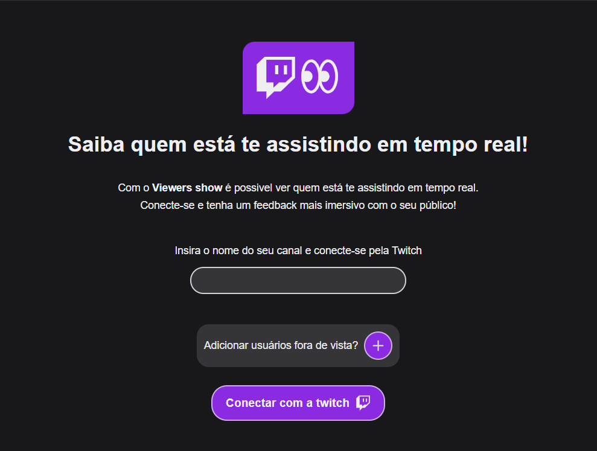
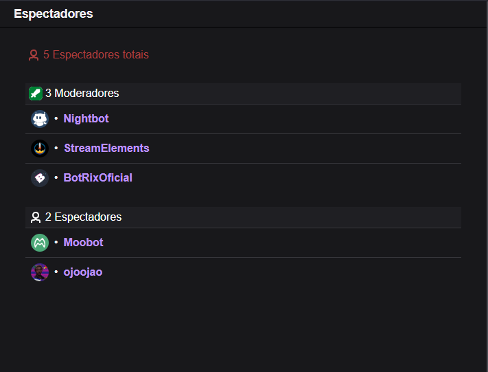

# 🎥 View Viewers
[](https://view-viewers.vercel.app)
[](https://react.dev)
[](https://www.typescriptlang.org/)
[](https://axios-http.com/)

## 📌 Sobre o projeto
O **View Viewers** é uma aplicação  desenvolvida em **React + TypeScript**  que consome a **API da Twitch** que permite visualizar em tempo real quem está assistindo sua live na Twitch.

🔹 Este projeto passou por **3 versões de evolução**:
1. **JavaScript Vanilla** – contato com consumo da API e estilização da interface. [Acesse o repositório clicando aqui](https://github.com/jlucassaldanha/js-view-viewers)  
2. **React (JavaScript)** – reestruturação para componentização e melhor escalabilidade. [Acesse o repositório clicando aqui](https://github.com/jlucassaldanha/react-view-viewers)
3. **React + TypeScript (deploy na Vercel)** – versão atual, com tipagem, organização de pastas, melhorias de performance e funcionalidades reformuladas. [Acesse o repositório clicando aqui](https://github.com/jlucassaldanha/view-viewers) 

## 🛠 Tecnologias Utilizadas
- **Front-end** → React, TypeScript, Vite 
- **Gerenciamento de rotas** → react-router-dom
- **Consumo de API** → Axios
- **Deploy e CI/CD simplificados** → Vercel

## 🎯 Funcionalidades
- Autenticação via conta da Twitch
- Exibição de:
  - Total de espectadores
  - Quantidade de moderadores
  - Quantidade de espectadores comuns  
- Exibição de **nome + foto de perfil** de cada espectador (link clicável para o perfil da Twitch)  
- Possibilidade de **ocultar usuários específicos** da listagem  

## 🖼️ Preview



## 🔧 Como rodar localmente
```bash
# Clonar o repositório
git clone https://github.com/jlucassaldanha/view-viewers.git

# Acessar pasta
cd view-viewers

# Instalar dependências
npm install

# Rodar projeto
npm run dev

# Abra http://localhost:5173 no seu navegador
```

### Rodar localmente com aplicativo próprio da twitch
- Acesse o [console da Twitch](https://dev.twitch.tv/console/apps) e faça login
- Registre seu aplicativo 
- Configure as URLs de redirecionamento OAuth para a sua URL seguindo o modelo: **https://sua_url/viewers**
- Categoria: **Analytics Tool**
- Tipo de cliente: **Confidencial**
- Copie seu **ID do cliente**
- Salve o aplicativo

Acesse o arquivo da página de conexão:
``` shell
src
└── pages
    └── ConnectMainPage.tsx
``` 

No arquivo mude `client_id` e `redirect_uri`:
```TypeScript
function ConnectMainPage() {
// ... Código anterior
	const client_id: string = "Seu ID do cliente"    
    const redirect_uri: string = "Sua url (sem o trecho '/viewers')"
// Restante do código ...
}
```

## 🔧 Próximos passos
- Implementar testes automatizados (unitários e integração)
- OAuth para usuários autenticados com a Twitch
- Banco de dados para armazenamento de configurações

## 🌍 Deploy
[👉 Acesse o projeto online](https://view-viewers.vercel.app)

## 📫 Contato
- [GitHub: jlucassaldanha](https://github.com/jlucassaldanha)
- [LinkedIn: João Lucas Saldanha](https://www.linkedin.com/in/joao-lucas-saldanha/)
