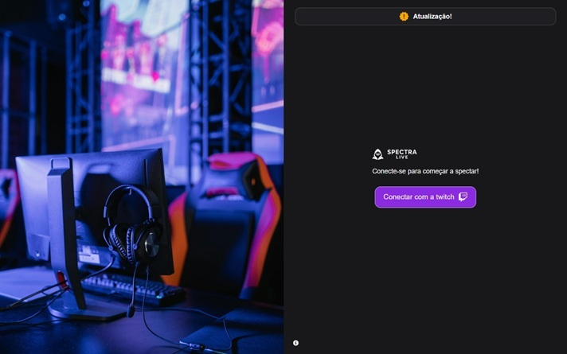
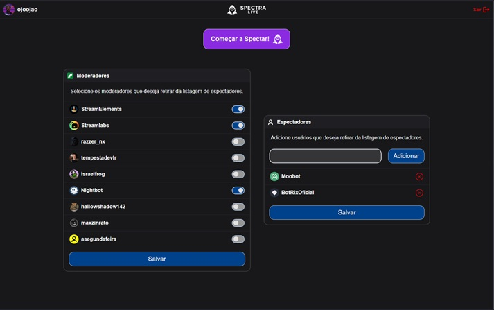
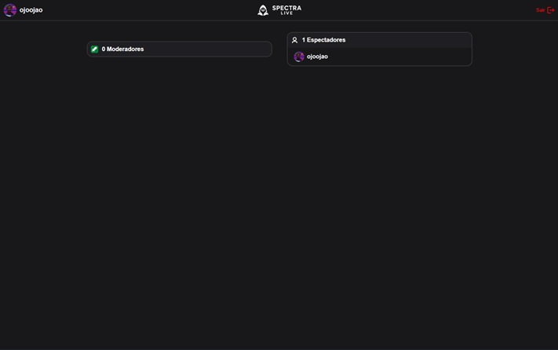
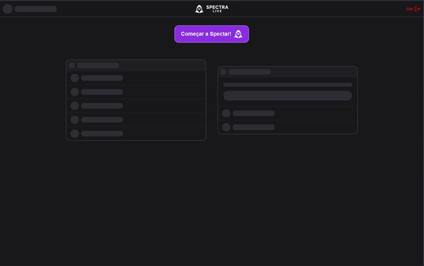
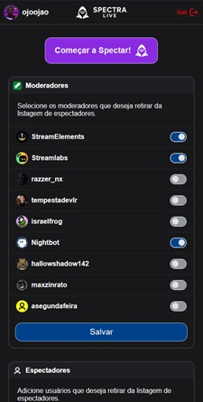

# 🎥 Spectra Live
[](https://spectralive.vercel.app)
[](https://react.dev)
[](https://www.typescriptlang.org/)
[](https://axios-http.com/)


## 📌 Sobre o projeto
O **Spectra Live** é uma aplicação web que mostra em tempo real quem está assistindo sua strem na Twitch.

**👉 Acesse em produção por aqui: [Spectra Live](https://spectralive.vercel.app)**

🔹 Este projeto já esta na sua **4ª versão**:
1. **JavaScript Vanilla** – Variáveis e configurações da API direcionadas a um usuário. Rodava por meio de servidor interno.
2. **React (JavaScript)** – Componentização e melhor escalabilidade. Ainda com servidor interno e direcionado a um usuário. 
3. **React + TypeScript (deploy na Vercel)** – Adição de tipagem, melhorias nos componentes, funcionalidades reformuladas permitindo que qualquer pessoa possa utilizar.
4. **React + TypeScript (frontend) e FastAPI + Postgres (backend)** – Versão atual, com uso de banco de dados PostgresSQL, autenticação e persistencia nas configurações de utilização, além de uma nova interface.

## 🛠 Tecnologias Utilizadas
- **Front-end** → React, TypeScript, Vite, react-router-dom, Axios
- **Back-end** → Python, FastAPI, SQLAlchemy, PostgreSQL  
- **Deploy e CI/CD simplificados** → Vercel + Render

## 🎯 Funcionalidades
- Login e Logout seguros → Autenticação via conta da Twitch e API própria
- Página de configuração de preferencias:
  - Moderadores excluidos da visualização
  - Espectadores comuns excluidos da visualização
- Página de exibição de espectadores conectados a live 

## 🖼️ Preview
### Home/Login

### Dashboard

### Espectadores

### Skeletons de carregamento

### Responsividade no formato mobile


## 🔧 Como rodar localmente
### Frontend

```bash
# Clonar o repositório
git clone https://github.com/jlucassaldanha/spectra-live.git

# Acessar pasta
cd spectra-live

# Instalar dependências
npm install

# Rodar projeto
npm run dev
```
#### Para rodar localmente com aplicativo próprio da twitch
- Acesse o [console da Twitch](https://dev.twitch.tv/console/apps) e faça login
- Registre seu aplicativo 
- Configure as URLs de redirecionamento OAuth para a sua URL seguindo o modelo: **https://sua_url/viewers**
- Categoria: **Analytics Tool**
- Tipo de cliente: **Confidencial**
- Salve o aplicativo
- Copie seu **ID do cliente**
- Copie seu **Segredos**

**Para isso é necessário o backend local também**

### Backend
Para rodar com API local
``` bash
# Clonar o repositório
git clone https://github.com/jlucassaldanha/spectra-server.git

# Acessar pasta
cd spectra-server

# Instalar dependências
pip install -r requirements.txt

# Rodar projeto
uvicorn app.main:app --reload
```
Necessário um .env com as variaveis:
``` shell
CLIENT_ID = 
CLIENT_SECRET = 
ALGORITHM = 
SECRET_KEY = 
DATABASE_URL =
API_URL = 
FRONTEND_URL = 
```

## 📂 Repositórios
- **Frontend**: github.com/jlucassaldanha/spectra-live
- **Backend**: github.com/jlucassaldanha/spectra-server

## 📫 Contato
[LinkedIn: João Lucas Saldanha](https://www.linkedin.com/in/joao-lucas-saldanha/)